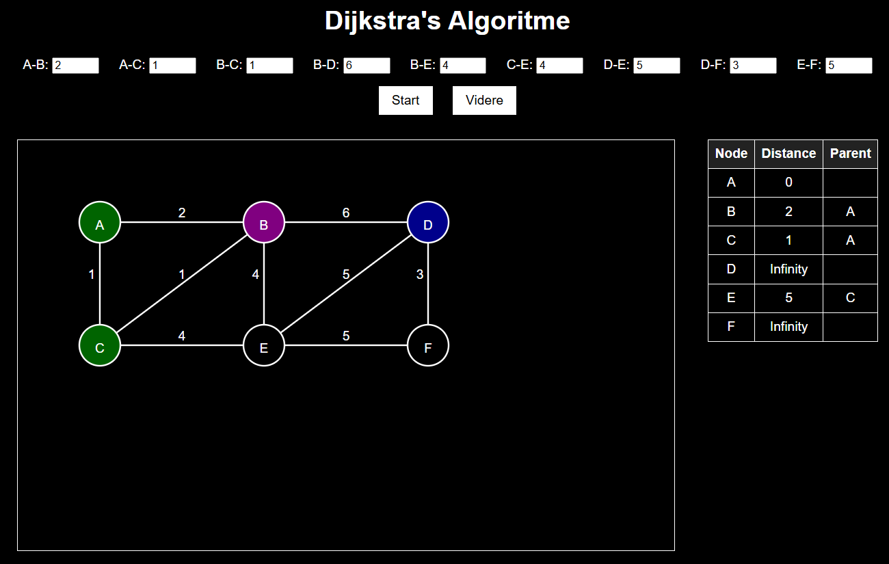

Dette projekt omhandler Dijkstra.

I projektet finder man algoritmen Dijkstra der bruger en graph og er visualiseret og kan tilgåes via en browser.
For at starte visualiseringen af Dijkstra algoritmen trykker man på Start-knappen og man kan så steppe sig igennem flowet ved at trykke på Videre-knappen.

Projektets repository er på GitHub her: https://github.com/Bransholm/Dijkstra
Projektet er deployet på GitHub Pages her: https://bransholm.github.io/Dijkstra/

Projektet er udarbejdet af: Kenneth Schou

